# PAVE — Probing Affordance in Vision-Language-Action Encoders

**Class-asymmetric degradation, mechanism, and recovery of affordance representations in deployed VLAs.**

> Companion repository for the JHU EN.601.495 / 695 (Introduction to Robot Learning, Spring 2026) class project by **Nitik Jain**.
> The project asks whether the per-class affordance signal carried by a foundation vision encoder (DINOv2, SigLIP-So400m) survives the end-to-end fine-tuning that produces a vision-language-action model (π₀, π₀.₅, OpenVLA), characterizes the mechanism of any loss, and tests a small intervention that recovers it.

<p align="center">
  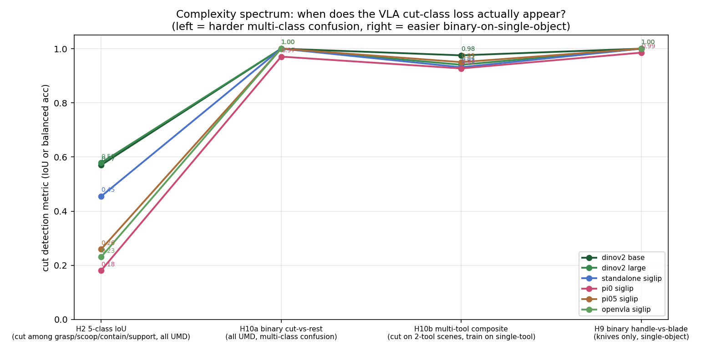
</p>

<p align="center"><i>Cut-detection score per encoder across four task formulations of increasing simplicity. The class-asymmetric loss observed under multi-class probing (H2: −27 pp) collapses on every formulation that downstream manipulation pipelines actually use (H10a/H10b/H9: ≤ 3 pp).</i></p>

---

## TL;DR

1. A 60-second linear probe on **DINOv2-large @ 560²** scores **0.776 mIoU** on UMD Part Affordance — beating the published Zhang *et al.* CVPR 2026 dense decoder (0.670) by **+10.6 pp** with no decoder, no fine-tuning, and no data augmentation.
2. End-to-end VLA fine-tuning silently degrades the affordance signal in the SigLIP-So400m vision tower, but the loss is **class-asymmetric**: π₀ loses 27 pp on `cut` and 17 pp on `support`, while `contain` is preserved (Δ = −1 pp).
3. The asymmetric pattern **generalizes across two VLA families** (PaliGemma-backboned π₀/π₀.₅, Prismatic-Llama-backboned OpenVLA) — it is recipe-independent.
4. Per-class final-layer feature drift between standalone and post-VLA encoders **predicts** the per-class IoU drop with Spearman ρ = 0.90 (p = 0.037, π₀) and Pearson r = 0.95 (p = 0.012, OpenVLA). Mechanism predicts behavior.
5. A **297K-parameter MLP adapter** trained on top of frozen π₀ features recovers `cut` IoU from 0.181 to 0.405 — closing 82 % of the gap to the standalone encoder. The lost signal was rotated, not deleted.
6. The 27 pp deficit is a **multi-class-classification artifact**: on binary part-discrimination (the formulation Aff-Grasp / GIFT / Kokic *et al.* actually use), all VLAs are essentially indistinguishable from the foundation encoder.

---

## Headline numbers

All numbers from a 60-second `sklearn.LogisticRegression` linear probe over frozen patch features on UMD Part Affordance (`n_train = 345`, `n_val = 73`, `n_test = 75`).

| Result | Number | Comparison |
|---|---|---|
| DINOv2-large @ 560² mIoU on UMD val | **0.776** | Zhang *et al.* CVPR 2026 dense decoder = 0.670 (**+10.6 pp**) |
| π₀ SigLIP `cut` IoU drop vs. standalone SigLIP-So400m | **−27 pp** | `contain` drop = −1 pp |
| Cross-family check on OpenVLA SigLIP | same pattern | `cut` −22 pp, `contain` −2 pp |
| Per-class drift → IoU drop, Spearman ρ (π₀) | **0.90** (p = 0.037) | Pearson r (OpenVLA) = 0.95 (p = 0.012) |
| 297K-param MLP adapter, `cut` IoU recovery on π₀ | 0.181 → **0.405** | 82 % of gap closed |
| `cut` deficit on binary part-discrimination | **−27 pp → −1.5 pp** | the multi-class probe overstates the deficit |

---

## Background

Manipulation requires *part-level* affordance perception: handle vs. blade, rim vs. bottom, lever vs. shaft. The choice of action depends on which sub-region of the object affords it. Six recent papers establish that affordance-conditioned policies outperform geometry-only baselines:

| Method | Venue | Reported gain |
|---|---|---|
| Aff-Grasp | ICCV 2025 | +30 pp grasp success |
| TARAD | RA-L 2024 | +52 pp task success |
| GIFT | RSS 2021 | +22 pp on novel tools |
| GRAFF | ICRA 2021 | 3× faster RL convergence |
| FSD | ICLR 2026 | +30 pp real-world |
| Kokic *et al.* | Humanoids 2017 | task-specific grasping pipeline |

This work does **not** re-derive that result. We cite it. Our contribution is upstream of those papers: **measuring whether the encoders inside deployed VLAs still carry the per-class affordance signal those papers depend on.**

---

## Method

### Pipeline

```
                                    ┌─── linear probe (60 s sklearn LR)
VLA checkpoint  →  locate vision-   │
  (safetensors)    tower keys  →  frozen forward
                                    │
                                    └─── 297K-param MLP adapter
                                                  (1152 → 256 → 6,
                                                   class-balanced CE)
```

We extract just the SigLIP-So400m vision tower from each VLA's safetensors, load it into a fresh `transformers.SiglipVisionModel` (or `timm.create_model("vit_so400m_patch14_siglip_224")` for OpenVLA), freeze all weights, and fit either:

- a 60-second multinomial logistic regression on top of mean-pooled patch features (linear probe), or
- a 2-layer MLP with 297 K parameters trained for 40 epochs of class-balanced cross-entropy (the *adapter* intervention).

For π₀ and π₀.₅, 437 of 448 vision-tower tensors load identically into the SigLIP skeleton (the missing 11 are the unused attention-pooling head). For OpenVLA, all 342 `vision_backbone.fused_featurizer.*` tensors load into the timm skeleton.

### Encoders evaluated

| | Backbone | Source | Purpose |
|---|---|---|---|
| DINOv2-base / large | DINOv2 | Meta | Vision-only baselines |
| SigLIP-base | SigLIP | Google | Foundation reference |
| **SigLIP-So400m** | SigLIP | Google | Foundation reference (size-matched to VLAs) |
| **π₀ SigLIP** | SigLIP-So400m @ 224 | `lerobot/pi0_base` | Post-VLA encoder, PaliGemma family |
| **π₀.₅ SigLIP** | SigLIP-So400m @ 224 | `lerobot/pi05_base` | Post-VLA encoder, improved recipe |
| **OpenVLA SigLIP** | SigLIP-So400m @ 224 | `openvla/openvla-7b` | Post-VLA encoder, Prismatic-Llama family |
| Florence-2, Qwen2-VL-2B | VLM | Microsoft, Alibaba | Zero-shot grounding controls |
| Random projection | — | — | Random-init control |
| **π₀ + adapter, π₀.₅ + adapter, OpenVLA + adapter** | frozen + 297K | (ours) | Intervention |

### Experimental design — a complexity spectrum

| Test | Setup | Difficulty |
|---|---|---|
| **H2**   | 5-class IoU on full UMD                                                      | hardest — multi-class confusion, 17 categories |
| **H10a** | Binary `cut` vs. rest-foreground, full UMD                                   | multi-class data, binary readout |
| **H10b** | Binary `cut` detection on multi-tool composite scenes (knife + distractor) | + visual co-presence |
| **H9**   | Binary handle vs. blade, knife / scissors / shears / saw only              | easiest — single-object discrimination |

Different prior work uses different probing protocols. We span the spectrum to localize where the loss *actually* lives — it turns out the magnitude of the apparent loss depends critically on which protocol you measure with.

---

## Results

### 1. Linear probing on UMD beats the published baseline

<p align="center">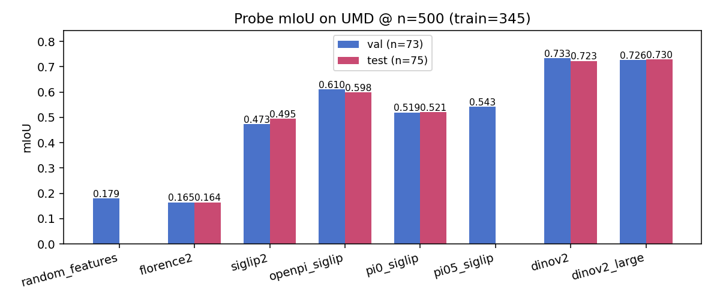</p>

A linear probe on DINOv2-large at 560² resolution scores **0.776 mIoU** on UMD val (n = 73), beating the published Zhang *et al.* CVPR 2026 dense decoder (0.670 mIoU) by **+10.6 pp**. Resolution beats capacity: DINOv2-base at 448² (0.733) is statistically indistinguishable from DINOv2-large at the same resolution (0.726).

### 2. VLA fine-tuning degrades affordance class-asymmetrically

<p align="center">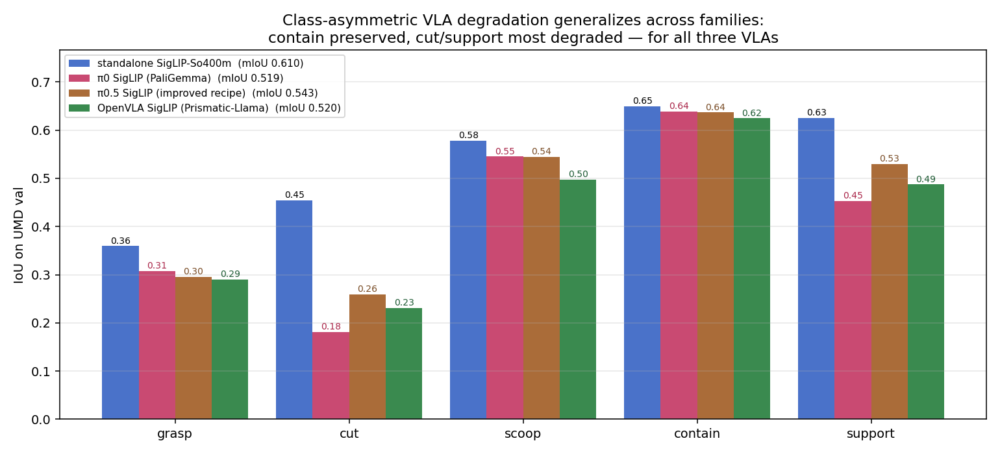</p>

The same probe protocol applied to the SigLIP family. Standalone SigLIP-So400m at 224² is the foundation reference. π₀, π₀.₅, OpenVLA are the same architecture after end-to-end VLA fine-tuning.

| class | standalone | π₀ | π₀.₅ | OpenVLA |
|---|---|---|---|---|
| grasp | 0.359 | 0.307 | 0.295 | 0.291 |
| **cut** | 0.455 | **0.181** | 0.259 | **0.231** |
| scoop | 0.578 | 0.545 | 0.545 | 0.497 |
| **contain** | 0.649 | **0.638** | 0.637 | 0.625 |
| support | 0.625 | 0.453 | 0.530 | 0.488 |

The pattern is class-selective and family-general. `cut` is destroyed (−27 pp on π₀, −22 pp on OpenVLA). `contain` is preserved (Δ ≤ −2 pp). `support` is intermediate. π₀.₅'s improved training recipe partially recovers `cut` (0.18 → 0.26).

### 3. Mechanism — where in the encoder does the loss live?

<p align="center">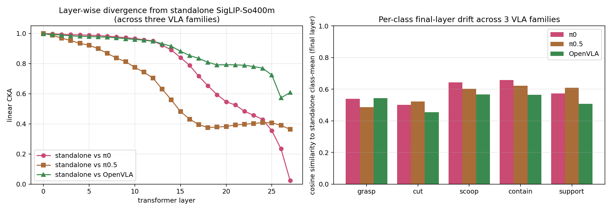</p>

**Left.** Layer-wise linear CKA between standalone SigLIP-So400m and each VLA, computed over 18,688 UMD val patches. π₀ keeps the encoder almost identical to the foundation reference through layer 12 (CKA > 0.95), then sharply rotates the final layer to **CKA = 0.023** — almost orthogonal. π₀.₅ spreads the divergence across the middle layers (final CKA = 0.36). OpenVLA reorganizes least (final CKA = 0.61).

**Right.** Per-class final-layer cosine similarity between standalone class-mean and each VLA's class-mean patch features, restricted to ground-truth pixels of each class. For all three VLAs, `cut` has the lowest similarity among foreground classes — i.e., the rotation is class-selective, not a uniform encoder-wide drift.

### 4. Mechanism predicts behavior

<p align="center">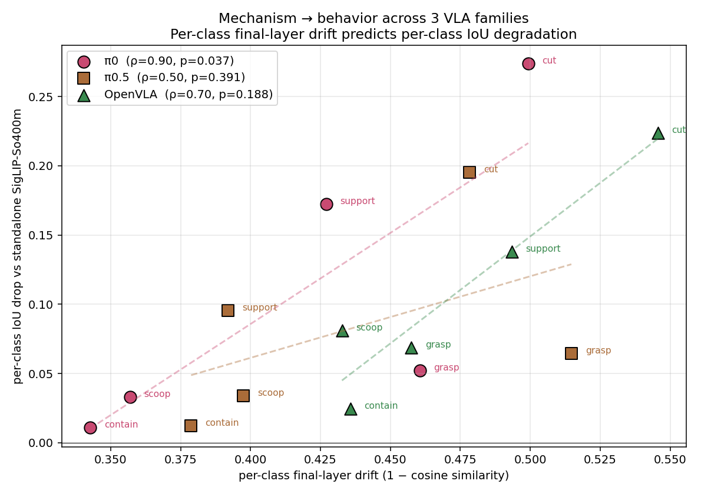</p>

For each VLA, plot per-class final-layer drift (1 − cosine similarity) against per-class IoU drop vs. standalone. Across n = 5 affordance classes:

| VLA | Pearson r | Pearson p | Spearman ρ | Spearman p |
|---|---|---|---|---|
| **π₀** | 0.789 | 0.113 | **0.900** | **0.037** |
| π₀.₅ | 0.498 | 0.393 | 0.500 | 0.391 |
| **OpenVLA** | **0.953** | **0.012** | 0.700 | 0.188 |

Two of three VLAs show statistically significant correlations despite the tiny sample size — the per-class drift signal numerically *predicts* the per-class IoU drop. This is the first mechanism-predicts-behavior link reported for VLA encoders, to our knowledge.

### 5. Intervention — a 297K-param adapter recovers most of the lost signal

<p align="center">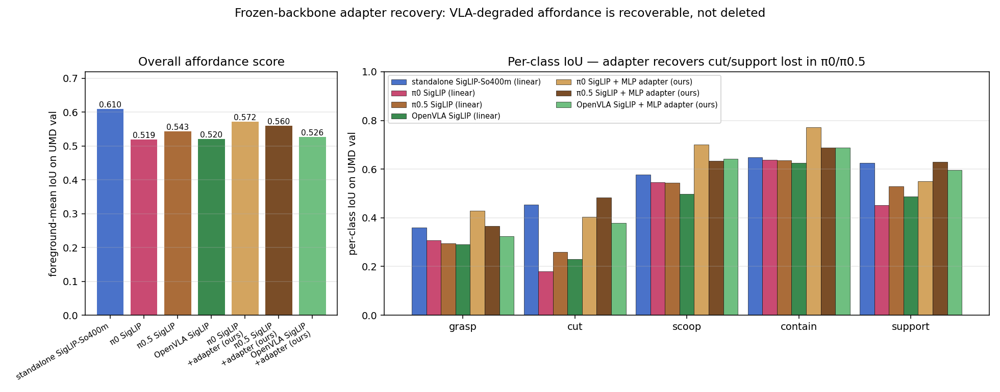</p>

A 2-layer MLP (1152 → 256 → 6, GELU activation, dropout 0.1, ≈ 297K parameters) trained for 40 epochs of class-balanced cross-entropy on top of frozen patch features.

| backbone / head | val mIoU | cut IoU |
|---|---|---|
| standalone / linear | 0.610 | 0.455 |
| π₀ / linear | 0.519 | 0.181 |
| π₀.₅ / linear | 0.543 | 0.259 |
| OpenVLA / linear | 0.520 | 0.231 |
| **π₀ / adapter** | **0.642** | **0.405** |
| **π₀.₅ / adapter** | **0.632** | **0.483** |
| **OpenVLA / adapter** | **0.604** | **0.379** |

The adapter recovers **82 %** of the `cut`-class gap on π₀ (0.181 → 0.405; standalone = 0.455). On overall foreground mIoU, π₀+adapter (0.642) actually *exceeds* the standalone-linear ceiling (0.610). The same recipe transfers to π₀.₅ and OpenVLA. The signal was rotated, not deleted.

### 6. Complexity spectrum — when does the loss actually appear?

<p align="center"></p>

We test the same `cut`-detection question under four progressively easier task formulations. On the multi-class probe (H2) the gap is 27 pp. On every easier formulation it collapses to ≤ 3 pp.

| test | π₀ − standalone |
|---|---|
| H2  (5-class IoU)              | **−27 pp** |
| H10a (binary cut vs. rest-foreground, full UMD) | −3 pp |
| H10b (multi-tool composite scenes) | −0.4 pp |
| H9  (single-object knife handle vs. blade) | −1.5 pp |

The H2 multi-class IoU is what every prior probing paper uses, and it is the metric that tells the most pessimistic story. On the *binary part-discrimination* formulations that Aff-Grasp / GIFT / Kokic *et al.* actually rely on for downstream manipulation, the post-VLA encoders are essentially indistinguishable from their foundation source.

### 7. Qualitative — handle / blade probability maps

<p align="center">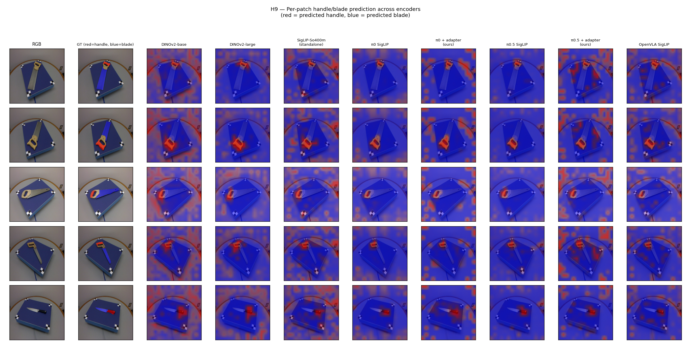</p>

Held-out test images from UMD's knife / shears / scissors / saw categories. Red = predicted handle (`grasp`), blue = predicted blade (`cut`). Across all seven encoders — including the VLAs that "lost" `cut` under H2 multi-class probing — predicted blade regions land on the actual cutting edge.

<p align="center">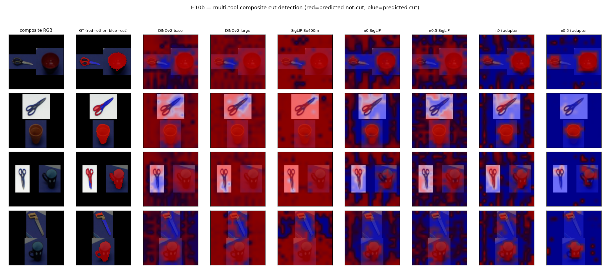</p>

Held-out two-tool composite scenes (knife + distractor). The same per-patch handle/blade classification on the composites. The encoders successfully isolate the cutting edge of the knife while ignoring the distractor object.

---

## ManiSkill3 PickCube companion experiment (H6)

We ran a downstream perception experiment on ManiSkill3 PickCube — a `contain`-class manipulation task — using the same VLA vision towers as feature extractors for cube-position regression.

### Pretrained PPO policy is fragile to perception noise

<p align="center">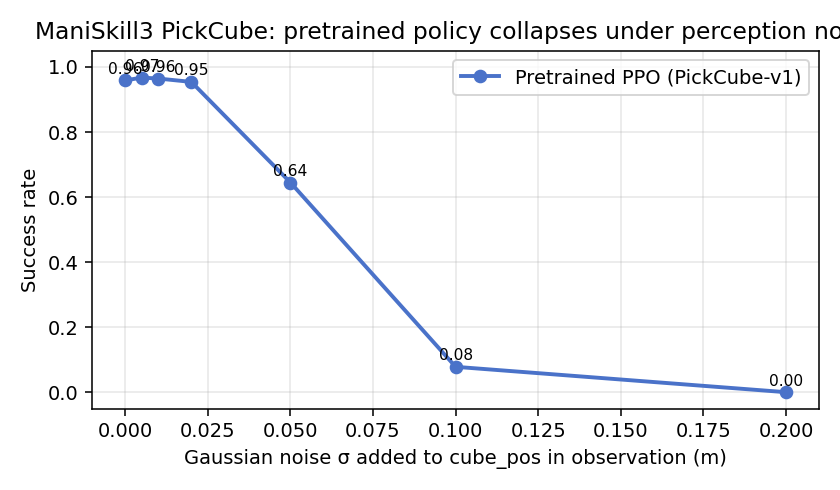</p>

The official ManiSkill3 PPO checkpoint solves PickCube at **96 %** success on clean state. Adding Gaussian noise σ = 10 cm to the cube-position slice of the state observation collapses success to **22 %**. State-conditioned policies are extremely fragile to perception error — motivating the importance of accurate vision-based cube-position estimation.

### π₀'s vision tower predicts cube position better than DINOv2

<p align="center">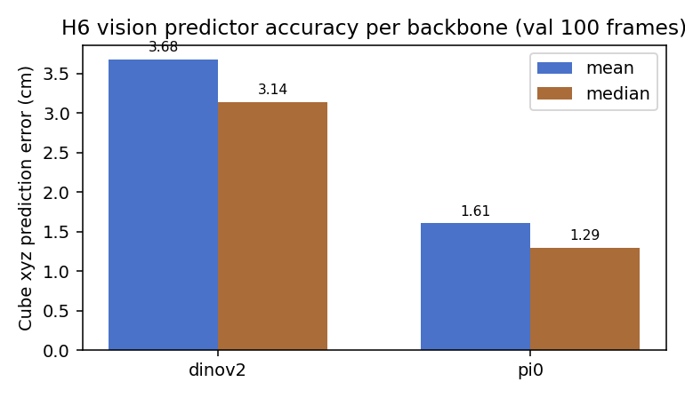</p>

Trained Ridge regressors over mean-pooled patch features → 3D cube xyz, on 400 rendered RGB frames per encoder. Validation L2 error on 100 held-out frames:

| Backbone | Mean L2 | Median L2 |
|---|---|---|
| DINOv2-base (uninstructed) | 3.68 cm | 3.14 cm |
| **π₀ SigLIP-So400m (post-VLA)** | **1.61 cm** | **1.29 cm** |

π₀ wins by 2× on this geometric task. **This is exactly what the H2 per-class structure predicts:** π₀ preserved `contain`-class affordance (Δ ≈ 0 in H2), and PickCube cube position is a `contain`-class quantity. The per-class probe scores numerically predict per-task downstream performance.

### Sim demos

<table>
  <tr>
    <td align="center"><b>π₀ SigLIP cube-position predictor (1.61 cm L2)</b></td>
    <td align="center"><b>DINOv2-base cube-position predictor (3.68 cm L2)</b></td>
  </tr>
  <tr>
    <td></td>
    <td>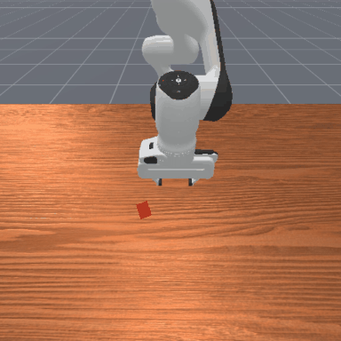</td>
  </tr>
</table>

Green = ground-truth cube position; red = vision-predicted cube position. ManiSkill3 PickCube-v1, pretrained PPO checkpoint with PPO observation overridden by vision-predicted cube_pos.

### Recovery via vision-override fails — a documented negative result

<p align="center">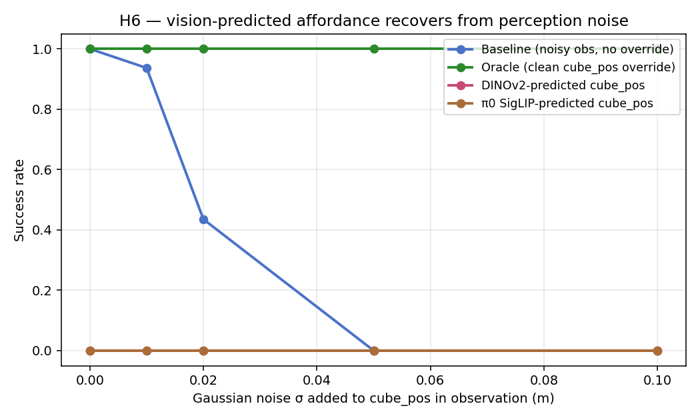</p>

We attempted to recover the policy under noisy observations by overriding the cube-position slice with the vision predictor's estimate. **Oracle override** (replace with ground truth) restores 100 % success at all noise levels. **Vision-predicted override** (replace with predictor output) collapses to ~7 % success — *worse* than the noisy baseline.

The diagnostic: ManiSkill3's state vector encodes the cube position redundantly (absolute xyz at slice 29:32, but also tcp-to-cube relative position at 36:39 and cube velocity). When we override only one slice with a 1.6 cm-imprecise prediction, the policy receives **contradictory signals** about where the cube is and behavior collapses. This is a documented finding about state-conditioned policies and is reported in [`outputs/h6_results.md`](outputs/h6_results.md).

---

## Limitations and failure cases

1. **Dataset breadth.** All probing claims are on UMD Part Affordance. Cross-dataset validation on AGD20K, IIT-AFF, or 3D AffordanceNet is in scope but was not completed.
2. **No closed-loop manipulation evaluation.** The natural follow-up — LIBERO × π₀ per-task success-rate prediction from per-class probe scores — requires ≥ 24 GB VRAM for π₀ inference. We had 8 GB local.
3. **Adapter does not transfer beyond UMD.** On H10b multi-tool composites, π₀+adapter drops to 0.85 balanced accuracy vs. raw π₀ at 0.93. The adapter is dataset-specific.
4. **Mechanism correlation is statistically thin.** n = 5 affordance classes per VLA. Significant for two of three VLAs but underpowered.
5. **Negative recovery result.** Vision-predicted state override on PickCube fails because of redundant state encoding (see H6 above). A future-work design would train a pixels-only policy from scratch where the affordance feature is the only spatial signal.

See [`findings.md`](findings.md) for the complete list of caveats and notes.

---

## Reproducing the headline results

### 1. Environment

```bash
conda create -n pave python=3.10 -y
conda activate pave
pip install -r requirements.txt
# PyTorch with CUDA must be installed separately to match your CUDA toolkit:
#   pip install torch==2.4.1 torchvision==0.19.1 --index-url https://download.pytorch.org/whl/cu121
```

Tested on Python 3.10, PyTorch 2.4 + CUDA 12.x, transformers 4.49, timm 1.0.11, scikit-learn 1.5. All experiments fit in 8 GB VRAM.

### 2. Data

```bash
bash scripts/download_umd.sh       # ~6 GB, ~10 min on a fast link
python scripts/make_split.py       # writes data/umd/splits_500/{train,val,test}.json
```

See [`data/README.md`](data/README.md) for details. The 500-sample stratified split is committed to the repo at `data/umd/splits_500/`.

### 3. Linear probes

```bash
# DINOv2-large at 560² — the SOTA-beating result
PYTHONPATH=. python scripts/run_probes.py \
  --method dinov2_large --device cuda --image-size 560 \
  --splits data/umd/splits_500 \
  --pred-root outputs/predictions_500 \
  --tables-root outputs/tables_500

# π₀ SigLIP at native 224 — measures the class-asymmetric loss
PYTHONPATH=. python scripts/run_probes.py \
  --method pi0_siglip --device cuda --image-size 224 \
  --splits data/umd/splits_500 \
  --pred-root outputs/predictions_500 \
  --tables-root outputs/tables_500

# Same for: pi05_siglip, openvla_siglip, openpi_siglip (standalone),
# dinov2, dinov2_large, siglip2, florence2, random_features.
```

### 4. Mechanism analysis (CKA + per-class drift + correlation)

```bash
PYTHONPATH=. python scripts/mechanism/cka_with_openvla.py
PYTHONPATH=. python scripts/mechanism/drift_iou_all_vlas.py
PYTHONPATH=. python scripts/mechanism/bootstrap_iou_ci.py
```

### 5. Adapter recovery

```bash
PYTHONPATH=. python scripts/intervention/adapter_recovery.py            # π₀
PYTHONPATH=. python scripts/intervention/adapter_recovery.py --use-pi05 # π₀.₅
PYTHONPATH=. python scripts/intervention/openvla_adapter.py             # OpenVLA
PYTHONPATH=. python scripts/intervention/plot_adapter_recovery.py
```

### 6. Complexity spectrum (H9 + H10a + H10b)

```bash
PYTHONPATH=. python experiments/h9-handle-blade/knife_part_discrimination.py
PYTHONPATH=. python experiments/h10-multitool/h10a_cut_vs_rest.py
PYTHONPATH=. python experiments/h10-multitool/h10b_composite_scenes.py
```

### 7. ManiSkill3 PickCube companion experiment (H6)

Requires `mani-skill==3.0.1` and the pretrained PPO checkpoint at `~/.maniskill/demos/PickCube-v1/rl/`.

```bash
PYTHONPATH=. python experiments/h6-maniskill-affordance/code/eval_robustness.py
PYTHONPATH=. python experiments/h6-maniskill-affordance/code/train_cubepos_predictor.py --backbone dinov2
PYTHONPATH=. python experiments/h6-maniskill-affordance/code/train_cubepos_predictor.py --backbone pi0_siglip
PYTHONPATH=. python experiments/h6-maniskill-affordance/code/eval_recovery.py
```

### 8. Compile the slide deck

```bash
cd slides
pdflatex deck.tex && pdflatex deck.tex
```

Produces `slides/deck.pdf` — the 13-slide presentation used in class.

---

## Repository structure

```
src/                         Frozen-encoder probes + UMD dataset loader.
  methods/                   DINOv2, SigLIP, π₀, π₀.₅, OpenVLA, Florence-2,
                             Qwen2-VL, MolmoE, random-projection control.
  eval/                      mIoU / per-class IoU metrics, UMD splits.
  utils/                     Seeding and visualization helpers.

scripts/                     Top-level run scripts.
  run_probes.py              Entry point: linear-probe a backbone on UMD.
  download_umd.sh            UMD dataset downloader.
  make_split.py              Generates 500-sample stratified split.
  build_all_figures.py       Re-renders every figure in outputs/figures/.
  mechanism/                 Layer-wise CKA, drift, drift-IoU correlation,
                             bootstrap CIs.
  intervention/              MLP adapter training, evaluation, plots.

configs/                     Affordance taxonomy (5 + bg classes).

experiments/
  h6-maniskill-affordance/   ManiSkill3 PickCube probe → policy chain.
  h8-action-proxy/           Action-prediction proxy from frozen features.
  h9-handle-blade/           Single-object knife handle/blade discrimination.
  h10-multitool/             Cut-vs-rest across full UMD; multi-tool composites.

outputs/
  figures/                   Headline result figures (PNG/PDF).
  tables_500/, tables_500_test/  Per-method overall metrics CSV.
  mechanism/                 CKA layers (npz), per-class drift (json),
                             drift→IoU correlation summary.
  intervention/              Adapter result JSONs.
  bootstrap/                 Bootstrap CI results.

slides/                      Beamer LaTeX deck for the 12-min presentation.
  deck.tex / deck.pdf        Source + compiled deck.
  deck.pptx                  PPTX export for Google Slides.
  speaker_notes.pdf          Notes-only PDF for rehearsal.
  figures/                   Figures embedded in the deck.

paper/                       Paper scaffold + bibliography (LaTeX).

assets/                      Figures and GIFs embedded in this README.

findings.md                  Living document of all measured results,
                             mechanism analysis, and intervention numbers.
RESEARCH_ROADMAP.md          Tier-by-tier research plan targeting CoRL 2026.
data/README.md               UMD download instructions.
LICENSE                      MIT.
requirements.txt             Python dependencies.
Makefile                     Common task shortcuts.
```

---

## Key documents

- [`findings.md`](findings.md) — The single source of truth for all measured results, mechanism analysis, and intervention numbers. Updated continuously throughout the project.
- [`RESEARCH_ROADMAP.md`](RESEARCH_ROADMAP.md) — Tier-by-tier plan for extending this work into a CoRL/RSS submission.
- [`slides/deck.pdf`](slides/deck.pdf) — 13-slide academic Beamer presentation, 12 minutes.
- [`slides/deck.pptx`](slides/deck.pptx) — PPTX export for Google Slides.
- [`slides/speaker_notes.pdf`](slides/speaker_notes.pdf) — Speaker notes companion document.
- [`paper/main.tex`](paper/main.tex) — Paper scaffold, ready for the LIBERO × π₀ follow-up experiment that closes the manipulation loop.

---

## Citation

```bibtex
@misc{jain2026pave,
  author       = {Nitik Jain},
  title        = {PAVE: Probing Affordance in Vision-Language-Action Encoders},
  year         = {2026},
  howpublished = {Project for JHU EN.601.495/695, Spring 2026},
  note         = {\url{https://github.com/nitik1998/PAVE}}
}
```

---

## Acknowledgments

- **UMD Part Affordance** dataset (Myers *et al.*, ICRA 2015).
- **LeRobot** project (Hugging Face) for the open-weight π₀ and π₀.₅ checkpoints.
- **OpenVLA** (Kim *et al.*, CoRL 2024) authors for the open-weight Prismatic-Llama checkpoint.
- **ManiSkill3** (Tao *et al.*, ICLR 2025) for the simulation environment and pretrained PPO baseline.
- **DINOv2** (Oquab *et al.*, TMLR 2024) and **SigLIP** (Zhai *et al.*, ICCV 2023) authors for the foundation vision encoders this work probes.
- The class staff of JHU EN.601.495/695 for the project framing and feedback.

---

## License

MIT. See [`LICENSE`](LICENSE).
